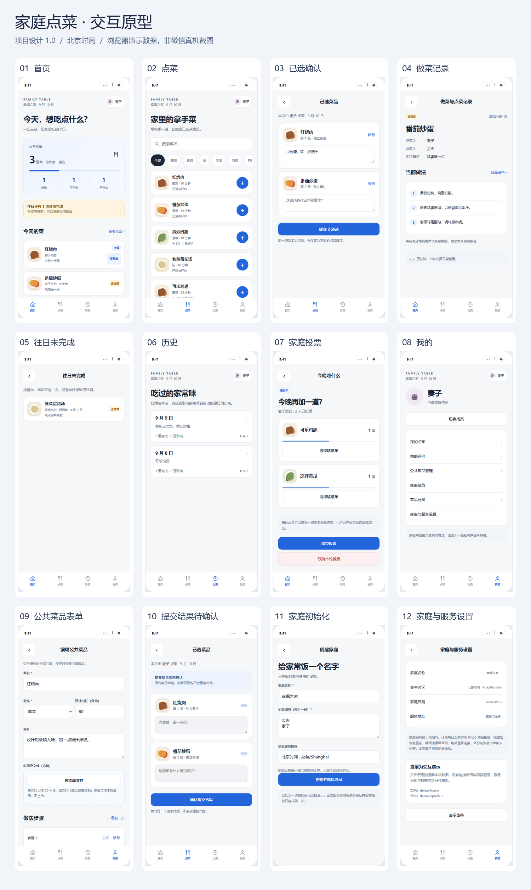

# Family meal planner · diancai

[中文](README.md) | **English**

[](LICENSE)

Decide what to eat together, volunteer to cook, and keep a record of each meal.

**Status: a development project for local integration.** A buildable Linux amd64 development container is included. Production maintenance commands, target-host acceptance and WeChat release acceptance remain outstanding. Use a trusted household LAN only; never expose the service publicly. Member selection records the business actor and is not authentication: anyone with network access may impersonate a member.



## What is included

- `miniprogram/`: a native WeChat client with 30 pages using WXML, SCSS and TypeScript.
- `server/`: a runnable HTTP/SQLite development server.
- `Dockerfile` and `deploy/compose.dev.yaml`: the development container and local build configuration.
- `contracts/`: HTTP API semantics.
- `docs/`: product, system, interaction, deployment and acceptance specifications.
- `prototype/`: a browser interaction prototype for design reference, separate from the real client.
- `tests/`: domain, database, deployment, HTTP, client and container checks.

## Quick start with Docker

Download or clone this repository and open its root directory. Use Docker Engine and Compose v2 with a Linux amd64 container engine:

```bash
docker compose -f deploy/compose.dev.yaml up -d --build --wait
```

The development API binds to host `http://127.0.0.1:3000`. Check `http://127.0.0.1:3000/health/ready`; the expected response is `{"status":"ready"}`. There is no web client at `/`. Data is stored in a local named Docker volume, separately from host development data.

See the [English Docker and WeChat tutorial](docs/DOCKER.en.md) or [中文教程](docs/DOCKER.zh-CN.md) for prerequisites, phone connectivity, persistence, stop/start commands and troubleshooting. This container does not run backups and is not a production release.

## Run directly with Node.js

### 1. Start the server

Install Node.js 24 and npm, then run in the repository root:

```bash
npm ci
npm run server:dev
```

The server listens on `http://0.0.0.0:3000`. Direct development data is written to `server/.local-data/current/`, which is ignored by Git. A new empty database is expected: initialize the household through the client. Do not run the Docker and direct server on the same host port at the same time.

The development implementation uses Node's built-in HTTP module and `node:sqlite`. The production target remains Node.js 24 / TypeScript / Fastify, a Linux amd64 image and actual linked SQLite >= 3.51.3. Local development results do not replace production acceptance.

### 2. Open the Mini Program

Open the **entire repository root** in WeChat DevTools, not the `miniprogram/` subdirectory. The root `project.config.json` sets `miniprogramRoot` to `miniprogram/`.

Shared configuration uses the `touristappid` placeholder. Configure your own AppID for your WeChat project capabilities and retain the placeholder when committing. `project.private.config.json` is local-only. The placeholder does not establish device or publishing permissions.

The default DevTools service URL is `http://127.0.0.1:3000`. Development URL validation is disabled for local HTTP integration. Follow the app flow: connect to service → create household → select member → home. The current application UI is in Chinese; these English documents do not change the UI language.

### 3. Connect a phone

The phone and Linux host must be on the same permitted household network. A phone's `127.0.0.1` points to the phone itself. Use the server's actual LAN address; `http://192.168.1.100:3000` is an example only. Docker defaults to loopback access and requires the explicit LAN configuration described in the tutorial.

Validate WeChat network rules, LAN permissions, iOS/Android behavior, uploads/downloads, weak networks and debug-disabled release behavior separately. Access from DevTools alone is not release acceptance.

Direct Node startup accepts only loopback Hosts with the actual listening port by default. For phone integration, set `ALLOWED_HOSTS` to the actual LAN `IP:port` before starting; separate multiple entries with commas. For example on Linux: `ALLOWED_HOSTS=192.168.1.100:3000 npm run server:dev` (replace the example IP). Docker derives this from its binding IP and published port. Browser requests carrying Origin are rejected unless explicitly listed in `ALLOWED_ORIGINS`; native requests without Origin need no such setting. See the Docker tutorial.

## Features and business guarantees

The client and server support household initialization, member selection, daily menus, a shared dish library, repeated orders with independent notes, batch submission, claiming/unclaiming/completing/cancelling items, overdue work, history and reordering, reviews, family voting, categories/settings and original media upload/download.

Batch intent is persisted before sending. An unknown result retains the same key and payload for reconciliation; switching members, service or data epoch never automatically resends old intent. Server transactions preserve batch atomicity and receipts. Menu items retain ordering snapshots, overdue items keep their original dates, and cancelled items do not contribute to effective progress or ratings.

Reviews are unique per member, dish and menu date, and cannot be edited after submission. Voting allows multiple selections per member and at most one menu item per round. File size is limited to 52,428,800 bytes, preserving original bytes.

## Recipe editing and tutorial import

“我的 → 我的待做” lists unfinished items claimed by the current member. “我的 → 菜谱编辑草稿” resumes local recipe drafts, isolated by household and member; drafts are removed after saving or explicit confirmed deletion.

Tutorial import can attempt to read publicly accessible Xiaohongshu image/text posts, or use saved images and pasted source text. Douyin is unsupported. Import creates a draft for review before saving a shared recipe. Platform/network restrictions may prevent link import; saved-image import remains available. Text inside images is not automatically recognized. Source links and attribution do not grant redistribution rights.

## Cooking results and family activity

Ordering supports quantity controls and random dish selection before normal confirmation. Completed items may retain result photos, notes and voice recordings. Images can be enlarged. Voting closes when all currently enabled members participate, with tied results decided by the initiator; closed votes retain participant details and history.

Voice attachments are supported for dish introductions, order notes, claiming, completion, reviews and votes. Profile features include avatars, vote history and household statistics. Paginated lists load 10 items at a time.

The current database schema is version 3. Production migrations require an authorized maintenance process; tests use temporary data. Automatic image import uses at most three concurrent downloads and preserves their order.

## Checks and contribution

```bash
npm test
npm run typecheck
node --test tests/domain.test.cjs
python tests/schema_test.py
python tests/deployment_test.py
```

Install Python check dependencies in a virtual environment with `python -m pip install -r requirements-dev.txt`. For prototype checks, install Chromium using `python -m playwright install chromium`, then run `python tools/build_prototype.py`, `python tests/browser_test.py` and `python tools/build_previews.py`. Preview generation requires a local CJK font; pass `--font` with its path if `fc-match` is unavailable.

After building the Docker image, `python tests/docker_smoke.py` verifies a disposable container project using synthetic data, including persistence after recreation. It removes only its own temporary project and volume. GitHub Actions configuration is in [.github/workflows/checks.yml](.github/workflows/checks.yml); consult actual run results rather than assuming success from configuration alone.

Read the applicable `AGENTS.md` before contributing. Keep changes focused, preserve business/data constraints, synchronize affected specifications and tests, and report checks honestly. Do not submit databases, household media, backups, personal configuration, AppIDs or secrets. Preserve third-party attribution and licenses. The detailed [contribution guide](CONTRIBUTING.md) is in Chinese.

## Documentation and security

- [Docker and WeChat tutorial (English)](docs/DOCKER.en.md) · [Docker 与微信教程（中文）](docs/DOCKER.zh-CN.md)
- Chinese specifications: [product rules](docs/01_产品规则.md), [system/data](docs/02_系统与数据设计.md), [interactions](docs/03_交互设计.md), [operations](docs/04_部署与数据运维.md), [acceptance](docs/05_开发与验收.md), [decisions](docs/06_配置与决策.md), [HTTP API](contracts/http-api.md).
- [Security policy (Chinese)](SECURITY.md) · [Third-party notices (Chinese)](THIRD_PARTY_NOTICES.md).

For a security issue, use GitHub's private vulnerability reporting when enabled, or a private contact channel published by the maintainer. If neither exists, request a private channel without publishing vulnerability details. Reports must not include real household data or credentials. No fixed response time is promised.

## Production boundary

The sole production route is Linux amd64 and Docker Compose. The development image does not complete the TypeScript/Fastify production target, target-host deployment, offline backup/restore/media-cleanup tooling or WeChat device/release acceptance. The policy requires exclusive offline backups at 04:00 Beijing time, the latest 10 successful archives and a weekly copy on another physical medium; no scheduler is installed by this repository's development container.

## License

Original project code and documentation are licensed under [Apache License 2.0](LICENSE). Third-party components, data and assets retain their own licenses. `private: true` in `package.json` prevents accidental npm publishing and does not make the source closed.
